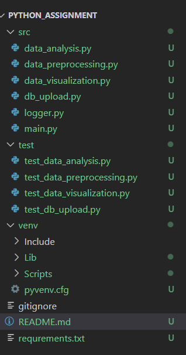

# Data_timeseries Application 

# How to use 

  --> git clone "https://github//url_of_the_repository 
  --> Create a virtual environment 
         # python -m venv venv
  --> Activate the virtual environment
         # ./venv/Scripts/activate
  --> Run requirements.txt file
        #  python -r requirements.txt
  
# How to run 

  -->  move to the project directory 
  -->  write following command in the terminal 
        # python src/main.py <file_path>

# Description 

 It is an aplication which will take file(time_series Dataset) as an argument as do the following opertion
  --> Analyse the data
  --> Remove unneccessary data and fill incomplete data in preprocessing
  --> Plot differet graphs and figure to visualize its insides
  --> Upload the data to the database (Mongodb)
  
 Error handling and log collection 
   Create file for 2 type of logs which provide the statement in json format
      -->error log
      -->info log

 Test module for each component

# Dataset 
 --> It is a time series dataset

 --> Name 
    Airline Baggage Complaints - Time Series Dataset
    Taken from "https://www.kaggle.com/datasets/gabrielsantello/airline-baggage-complaints-time-series-dataset"
    format  == CSV  

 -->Description 
    The data set contains monthly observations from 2004 to 2010 for United Airlines, American Eagle, and Hawaiian Airlines. The variables in the data set include:

    ## Baggage -   The total number of passenger complaints for theft of baggage contents, or for lost, damaged,
                    or misrouted luggage for the airline that month
    ## Scheduled - The total number of flights scheduled by that airline that month
    ## Cancelled - The total number of flights cancelled by that airline that month
    ## Enplaned  - The total number of passengers who boarded a plane with the airline that month
# File structure 

# DataBase
download Mondodb
run below command in terminal
cd C:\Program Files\MongoDB\Server\7.0\bin
mongod.exe
